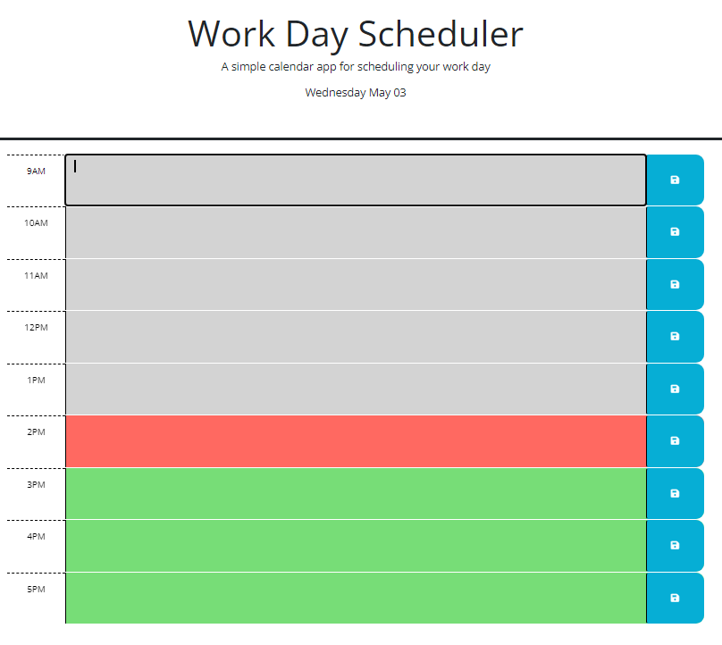
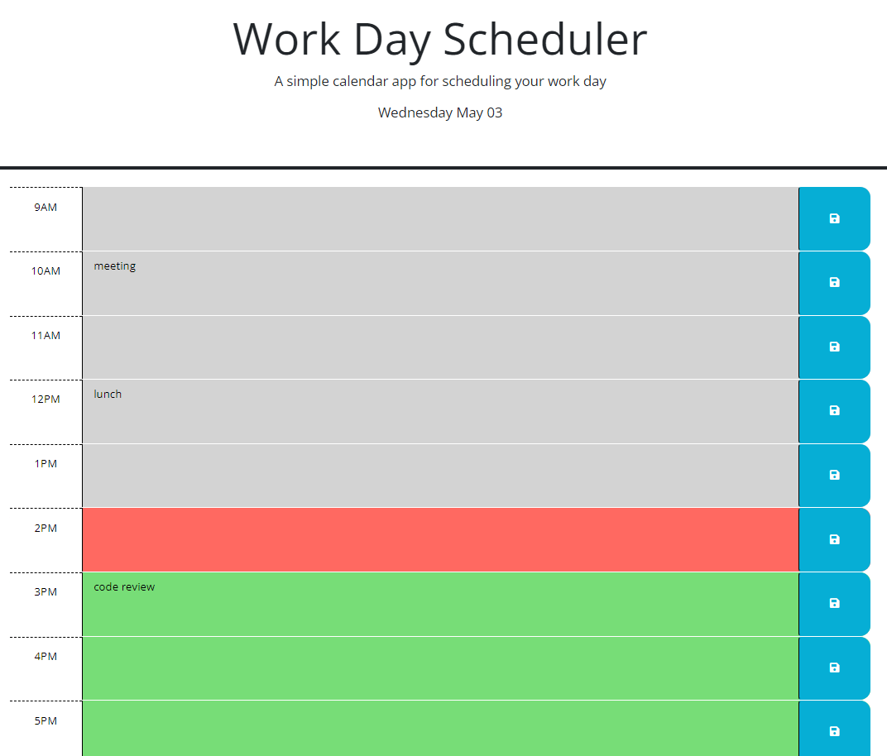

# Calendar Application 

## Description
This is a calendar application. It displayes time blocks from 9am to 5pm, the tradtional workday. The user can enter tasks or events in the paragraph blocks in each time block to save a reminder. The time blocks are color coded for past, present and future. Gray reperesents the past, red the current hour, and green the future.
## Installation 
N/A
## Usage
The user is presented with the calendar upon opening the app. The color coded area reperesents the text input for events in the time block. The user can type something in and press the save button to the right of the block to save the entry. To clear a block, the user must manually delete text in th einput and save the empty block. 
Link to app: https://pconenna.github.io/05-calendar/
## Screenshots

## Credits
I worked on this project alone using the class materials from module 5 and documentation as references.
## License 
Please refer to the license in the repo.